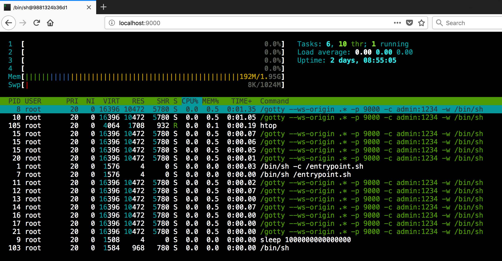

### What if you want your dev environment running in a docker container in the cloud and access the terminal as a web application?
✔ Use this docker image to do just that

### <sup>[1](#myfootnote1)</sup>Breaking the rules

* You always develop locally then go through build, test, deploy life cycle and repeat
* Your development environment must be set up on your local computer.
* You must always SSH into the box if you are given access

### How to run this docker image
```sh
$ docker run --name alpinegovim -d -e CREDENTIAL="admin:1234" -p 9000:9000 7onetella/alpinegovim:latest
```
Access the terminal on your browser by hitting http://localhost:9000  

* username: `admin`
* password: `1234`

shown here: terminal session in a browser
<p align="center">
  
</p>

#### Languages & tools included in the docker image
* go 1.9.2
* python
* pip
* nodejs
* npm
* git
* aws cli
* curl
* vim-go
* glide & godep
* esc
* gox
* httpstat
* gotty

---

<a name="myfootnote1">1</a> [How to Break the Rules • Dan North](https://youtu.be/hZFShSjAhlQ?t=12m2s)

